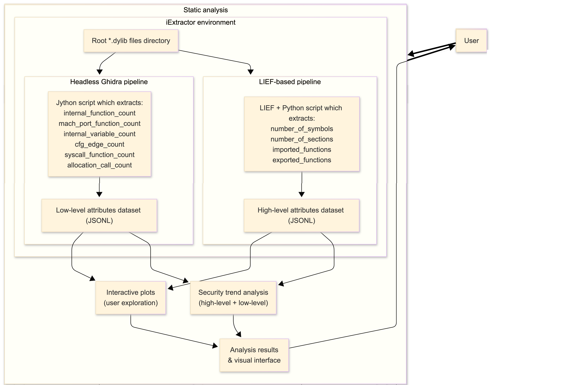

# DylibScope: Static Security Trend Analysis of iOS Dynamic Libraries

DylibScope is a static analysis project for studying the evolution of iOS dynamic libraries across multiple iOS versions. It extracts high-level Mach-O metadata and low-level binary metrics from `.dylib` files, stores the results as JSONL datasets, and generates interactive plots and a textual security trend analysis report.

The project is intended for mobile security research and coursework. It does **not** prove that a library is vulnerable. The reported scores and labels are heuristic indicators that help identify version transitions or libraries that may deserve deeper manual review.

## Overview

DylibScope has two static analysis branches:

1. **High-level analysis**
   - Uses Python and LIEF to parse Mach-O dynamic libraries.
   - Extracts metadata such as sections, symbols, imported functions, exported functions, library path, and iOS version label.

2. **Low-level analysis**
   - Uses Ghidra in headless mode with a Jython script.
   - Extracts implementation-level metrics such as internal function count, internal variable count, CFG edge count, allocation call count, syscall-related function count, and Mach-port-related function count.

Both branches produce JSONL datasets. These datasets are consumed by the visualization and security trend analysis modules.

## Architecture

The pipeline is organized as follows:



Main components:

| Component | Role |
|---|---|
| iExtractor output | Provides extracted iOS `.dylib` files |
| LIEF pipeline | Extracts symbols, sections, imports, and exports |
| Ghidra headless pipeline | Extracts functions, CFG edges, allocation/syscall/Mach-port metrics |
| JSONL datasets | Store one record per library and iOS version |
| Plot generator | Builds interactive Plotly visualizations |
| Security trend analysis | Computes heuristic version-level trend indicators |
| GitHub Pages | Publishes interactive results |

## Repository Structure

```text
dylibscope/
├── docs/                          # GitHub Pages output
├── scripts/                       # Runnable project commands
├── src/
│   └── dylibscope/
│       ├── analysis_graph/        # Plot generation logic
│       ├── config/                # Shared global configuraion
│       ├── high_level_analysis/   # LIEF-based extraction
│       ├── low_level_analysis/    # Ghidra/Jython extraction
│       └── security_analysis/     # Trend reports and heuristic scoring
├── tests/                         # Unit tests
├── pyproject.toml
└── README.md
```

## Requirements

The Python part of the project targets **Python 3.9 or newer**.

Main Python dependencies include:

- `lief`
- `pandas`
- `plotly`

Development dependencies include:

- `ruff`
- `pytest`
- `pytest-cov`

The low-level extraction pipeline also requires a local Ghidra installation. The Ghidra script runs in Ghidra/Jython and is intentionally kept separate from normal Python package imports.

## Setup

Create and activate a virtual environment:

```bash
python -m venv .venv
source .venv/bin/activate
```

Install the project in editable mode:

```bash
python -m pip install -e ".[dev]"
```

## Datasets

DylibScope works with two generated JSONL datasets:

High-level dataset:
```text
src/dylibscope/high_level_analysis/dylibs_analysis_local.json
```

Low-level dataset:
```
src/dylibscope/low_level_analysis/ghidra_out/merged.json
```

The default dataset paths are defined in:

```text
src/dylibscope/config/datasets.py
```

These paths are defaults only. Users can provide custom dataset paths when generating plots or reports.

## High-Level Extraction

The high-level pipeline uses LIEF to parse Mach-O `.dylib` files.

Typical output fields include:

- library path
- iOS version label
- section count
- symbol count
- imported functions
- exported functions

Run the high-level extraction module from the repository root:

```bash
python -m dylibscope.high_level_analysis.extract_high_level
```

## Low-Level Extraction

The low-level pipeline uses Ghidra headless analysis.

It extracts metrics such as:

- internal function count
- internal variable count
- CFG edge count
- allocation call count
- syscall-related function count
- Mach-port-related function count

The low-level pipeline is executed through Ghidra's `analyzeHeadless` command. The extraction script runs inside Ghidra/Jython, not as a normal Python script. The exact paths depend on the local Ghidra installation, temporary project location, extracted iOS library directory, script location, and output directory.


```bash
/path/to/ghidra/support/analyzeHeadless \
  /path/to/temporary/ghidraProject ghidraPr \
  -import /path/to/iextractor/out \
  -recursive \
  -overwrite \
  -max-cpu 8 \
  -scriptPath /path/to/ghidra_scripts \
  -postScript extract_low_level.py /path/to/ghidra_out \
  -deleteproject \
  -log /path/to/ghidra_headless.log
```

The resulting per-library outputs are aggregated into a merged JSONL dataset used by the plotting and trend-analysis scripts.

## Generate Interactive Plots

Generate the default high-level and low-level plots:

```bash
python scripts/generate_plots.py
```

The generated HTML files are written to `docs/` and can be opened directly in a browser.


## Generate Security Trend Reports

Generate the default high-level and low-level security trend reports:

```bash
python scripts/generate_reports.py
```

Custom dataset paths can be supplied:

```bash
python scripts/generate_reports.py \
  --hla-input path/to/high_level_dataset.jsonl \
  --lla-input path/to/low_level_dataset.jsonl
```

The reports compare consecutive iOS versions using common-library overlap and metric deltas. Version transitions may be labeled as:

- stable
- expanding
- hardening
- partial snapshot
- insufficient overlap

These labels are heuristic and should be interpreted as triage signals, not vulnerability claims.

## Normalized SQLite Storage

After the high-level and low-level JSONL datasets have been generated, DylibScope can import them into a normalized SQLite database. This provides a local query backend for library metrics and prepares the project for the future client API.


The storage layer normalizes:

* datasets
* iOS firmware labels
* library names
* high-level metrics
* low-level metrics
* library observations across iOS versions

The importer stores both the full firmware label and parsed version fields. For example:

```text
iPhone11,8_12.0_16A366
```

is stored as:

```text
device_model  = iPhone11,8
ios_release   = 12.0
build_number  = 16A366
```

This allows queries by either the full firmware label or only the iOS release.

### Import JSONL datasets into SQLite

From the repository root:

```bash
python scripts/import_datasets.py \
  --db data/dylibscope.sqlite \
  --dataset-name public-baseline \
  --hla-input src/dylibscope/high_level_analysis/dylibs_analysis_local.json \
  --lla-input src/dylibscope/low_level_analysis/ghidra_out/merged.json
```

This creates the SQLite database at:

```text
data/dylibscope.sqlite
```

If the `data/` directory does not exist, it is created automatically.

The generated SQLite database is a local artifact and should normally not be committed.

### Query metrics from the SQLite database

Query all high-level metrics for a library in a specific iOS release:

```bash
python scripts/query_metrics.py libsqlite3.0.dylib \
  --db data/dylibscope.sqlite \
  --dataset-name public-baseline \
  --ios-version 6.0 \
  --level high
```

Query low-level metrics for a library:

```bash
python scripts/query_metrics.py libSimplifiedChineseConverter.dylib \
  --db data/dylibscope.sqlite \
  --dataset-name public-baseline \
  --ios-version 12.0 \
  --level low
```

Query using the full firmware label:

```bash
python scripts/query_metrics.py libSimplifiedChineseConverter.dylib \
  --db data/dylibscope.sqlite \
  --dataset-name public-baseline \
  --ios-version iPhone11,8_12.0_16A366 \
  --level low
```

Query one exact metric without specifying whether it is high-level or low-level:

```bash
python scripts/query_metrics.py libsqlite3.0.dylib \
  --db data/dylibscope.sqlite \
  --dataset-name public-baseline \
  --metric imported_function_count
```

Query all available metrics for a library across every iOS version in which it appears:

```bash
python scripts/query_metrics.py libsqlite3.0.dylib \
  --db data/dylibscope.sqlite \
  --dataset-name public-baseline
```

### SQLite inspection

Inspect the generated database manually:

```bash
sqlite3 data/dylibscope.sqlite ".tables"
```

Useful sanity checks:

```sql
SELECT COUNT(*) FROM libraries;
SELECT COUNT(*) FROM ios_versions;
SELECT COUNT(*) FROM library_observations;
SELECT COUNT(*) FROM metric_values;
SELECT COUNT(*) FROM import_errors;
```

Check parsed iOS version labels:

```sql
SELECT version_label, device_model, ios_release, build_number
FROM ios_versions
LIMIT 10;
```

Check import errors:

```sql
SELECT *
FROM import_errors
LIMIT 20;
```

Ideally, the `import_errors` table should be empty. If it is not empty, inspect the rows to identify malformed or incomplete JSONL records.


## GitHub Pages Dashboard

The public dashboard is served from the `docs/` directory.

The dashboard links to the generated interactive Plotly visualizations. After regenerating plots, commit the updated HTML files in `docs/` if they should be reflected on GitHub Pages.

Typical workflow:

```bash
python scripts/generate_plots.py
git add docs/
git commit -m "Update generated dashboard plots"
git push
```

## Testing

Run the test suite:

```bash
pytest
```

Run linting and formatting:

```bash
ruff check src scripts tests --fix
ruff format src scripts tests
```

Recommended validation before submission:

```bash
ruff check src scripts tests
pytest
python -m compileall src
python scripts/generate_plots.py
python scripts/generate_reports.py
```

## Known Limitations

- The project performs static analysis only.
- The reported security scores are heuristic indicators, not proof of vulnerabilities.
- Low-level extraction depends on Ghidra and may take significant time on large firmware datasets.
- Results depend on the completeness and consistency of the extracted `.dylib` dataset.
- Some iOS versions may be partial snapshots, which can affect trend interpretation.
- The project does not redistribute iOS firmware or Apple binaries.

## License and Data Notice

Users are responsible for obtaining and analyzing firmware data in a lawful and appropriate research environment.
