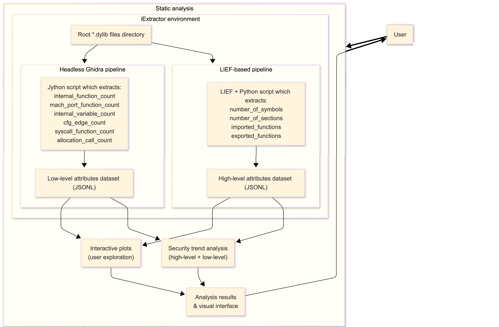

# DylibScope

**Static security trend analysis of iOS dynamic libraries.**

DylibScope studies how iOS `.dylib` files evolve across iOS versions. It combines high-level Mach-O analysis and low-level binary analysis, stores normalized observations, exposes them through a web platform and API, and generates plots and heuristic security trend summaries.

The project is intended for mobile security research and coursework. It does **not** prove that a library is vulnerable. Scores, bands, and trend labels are heuristic triage indicators that can help identify libraries or version transitions that deserve deeper manual review.

## Live Project

- **Web application:** <https://dylibscope.onrender.com>
- **API documentation:** <https://dylibscope-api.onrender.com/docs>
- **API base URL:** <https://dylibscope-api.onrender.com>
- **Interactive dashboards:** <https://sebastianion.github.io/dylibscope/>

The frontend and FastAPI backend are deployed on Render. Production datasets are stored in Supabase PostgreSQL, while generated Plotly dashboards are published through GitHub Pages.

## Overview

DylibScope focuses on longitudinal static analysis of iOS system dynamic libraries. It supports:

- high-level Mach-O analysis with LIEF;
- low-level analysis with Ghidra headless and Jython;
- comparison of libraries and iOS-version transitions;
- heuristic library-level and version-level security summaries;
- normalized dataset storage and querying;
- a deployed React interface and FastAPI backend;
- private manual datasets and user-uploaded high-level analysis;
- generated Plotly dashboards and textual trend reports.

## Architecture



```text
iOS .dylib files
    ├── LIEF high-level analysis
    └── Ghidra low-level analysis
             ↓
         JSONL datasets
             ↓
      Normalized storage
   SQLite / Supabase PostgreSQL
             ↓
        FastAPI backend
             ↓
 React UI / reports / dashboards
```

The offline analysis pipeline generates the baseline research data. The deployed platform reads normalized results from storage and provides interactive exploration, comparison, reporting, and private user-dataset workflows.

## Analysis and Data

| Analysis | Engine | Example metrics |
|---|---|---|
| High-level analysis | Python + LIEF | sections, symbols, imports, exports, deployment target |
| Low-level analysis | Ghidra headless + Jython | CFG edges, internal functions/variables, allocation calls, syscall-related functions, Mach-port-related functions |

DylibScope currently works with three main dataset categories:

| Dataset type | Description |
|---|---|
| `public-baseline` | Baseline HLA + LLA observations generated by the project pipelines |
| Manual private dataset | User-provided observations created through the UI or API |
| Uploaded HLA private dataset | High-level metrics extracted from user-supplied `.dylib` files |

Uploaded binaries are processed temporarily. Only extracted metrics are retained. Cloud upload processing currently performs high-level LIEF analysis only; Ghidra low-level analysis remains an offline workflow.

## Web Platform

The deployed interface provides:

- **Library Explorer** for browsing metrics and security reports;
- **Compare** for comparing libraries or one library across iOS versions;
- **iOS Summary** for version-level heuristic summaries;
- **Manual Datasets** for creating and managing private observations;
- **Upload Library Files** for high-level analysis of `.dylib` files supplied in a `.zip`;
- **Dashboards** for accessing generated interactive visualizations;
- **Methodology** for metric and scoring context.

Public baseline data is available through the platform, while user-created datasets are private to the current authenticated session/user.

## API

The FastAPI backend exposes dataset, library, comparison, reporting, manual-observation, and upload operations.

Interactive Swagger documentation:

<https://dylibscope-api.onrender.com/docs>

<details>
<summary><strong>API endpoints</strong></summary>

| Method | Endpoint | Purpose |
|---|---|---|
| GET | `/health` | API health check |
| GET | `/v1/auth/session` | Current authenticated or anonymous session |
| GET | `/v1/datasets` | List visible datasets |
| POST | `/v1/user-observations` | Create a manual user observation |
| GET | `/v1/user-observations` | List user observations |
| DELETE | `/v1/user-observations` | Delete a user observation |
| POST | `/v1/user-uploads/dylib-zip` | Upload a `.zip` containing `.dylib` files |
| GET | `/v1/user-uploads/jobs/{job_id}` | Read upload job status |
| DELETE | `/v1/user-datasets/{dataset_name}` | Delete a private user dataset |
| GET | `/v1/libraries` | List libraries |
| GET | `/v1/ios-versions` | List iOS versions |
| GET | `/v1/ios-versions/{ios_version}/security-summary` | Version-level heuristic security summary |
| GET | `/v1/libraries/{library_name}/metrics` | Metrics for one library |
| GET | `/v1/libraries/{library_name}/timeline` | Timeline for one library |
| GET | `/v1/libraries/{library_name}/security-report` | Library-level heuristic security report |
| POST | `/v1/libraries/compare` | Compare multiple libraries |
| POST | `/v1/libraries/{library_name}/compare-versions` | Compare one library across versions |

</details>

<details>
<summary><strong>Example API requests</strong></summary>

Query high-level metrics for one library:

```bash
curl "http://127.0.0.1:8000/v1/libraries/libsqlite3.0.dylib/metrics?dataset_name=public-baseline&ios_version=6.0&level=high"
```

Compare one library across iOS versions:

```bash
curl -X POST "http://127.0.0.1:8000/v1/libraries/libsqlite3.0.dylib/compare-versions" \
  -H "Content-Type: application/json" \
  -d '{
    "dataset_name": "public-baseline",
    "ios_versions": ["6.0", "7.0"],
    "metrics": ["num_symbols", "imported_function_count"]
  }'
```

Upload a `.zip` containing one or more `.dylib` files:

```bash
curl -X POST "http://127.0.0.1:8000/v1/user-uploads/dylib-zip" \
  -H "Authorization: Bearer <access-token>" \
  -F "dataset_name=my-uploaded-dataset" \
  -F "target_mode=new_private_dataset" \
  -F "conflict_mode=reject" \
  -F "ios_version=12.0" \
  -F "file=@libraries.zip;type=application/zip"
```

</details>

## Local Development

### Requirements

- Python 3.9 or newer
- Node.js and npm for the frontend
- Ghidra for the low-level extraction pipeline

Create a virtual environment and install the Python project:

```bash
python -m venv .venv
source .venv/bin/activate
python -m pip install -e ".[dev,api]"
```

Import generated HLA and LLA datasets into a local SQLite database:

```bash
python scripts/import_datasets.py \
  --db data/dylibscope.sqlite \
  --dataset-name public-baseline \
  --hla-input src/dylibscope/high_level_analysis/dylibs_analysis_local.json \
  --lla-input src/dylibscope/low_level_analysis/ghidra_out/merged.json
```

Run the API:

```bash
python scripts/run_api.py --db data/dylibscope.sqlite
```

Run the frontend:

```bash
cd ui
npm install
npm run dev
```

## Offline Analysis

Run the LIEF-based high-level extraction:

```bash
python -m dylibscope.high_level_analysis.extract_high_level
```

The low-level pipeline runs through Ghidra's `analyzeHeadless` command using the project's Jython extraction script. Its exact command depends on the local Ghidra installation and extracted firmware paths.

Generate interactive plots:

```bash
python scripts/generate_plots.py
```

Generate textual security trend reports:

```bash
python scripts/generate_reports.py
```

Generated dashboard files are written to `docs/`.

## Testing

Run the test suite:

```bash
pytest
```

Run linting:

```bash
ruff check src scripts test
```

Recommended validation before deployment or submission:

```bash
ruff check src scripts test
pytest
python -m compileall src
python scripts/generate_plots.py
python scripts/generate_reports.py
cd ui && npm run build
```

## Limitations

- DylibScope performs static analysis only.
- Security scores and bands are heuristic indicators, not vulnerability proof.
- Cloud upload processing currently performs HLA only; Ghidra/LLA processing is not run in the upload workflow.
- Low-level extraction depends on Ghidra and can take significant time on large firmware datasets.
- Results depend on the completeness and consistency of the extracted iOS library data.
- Partial firmware snapshots can affect longitudinal comparisons.
- The project does not redistribute iOS firmware or Apple binaries.

## Data Notice

Users are responsible for obtaining and analyzing firmware data in a lawful and appropriate research environment.
